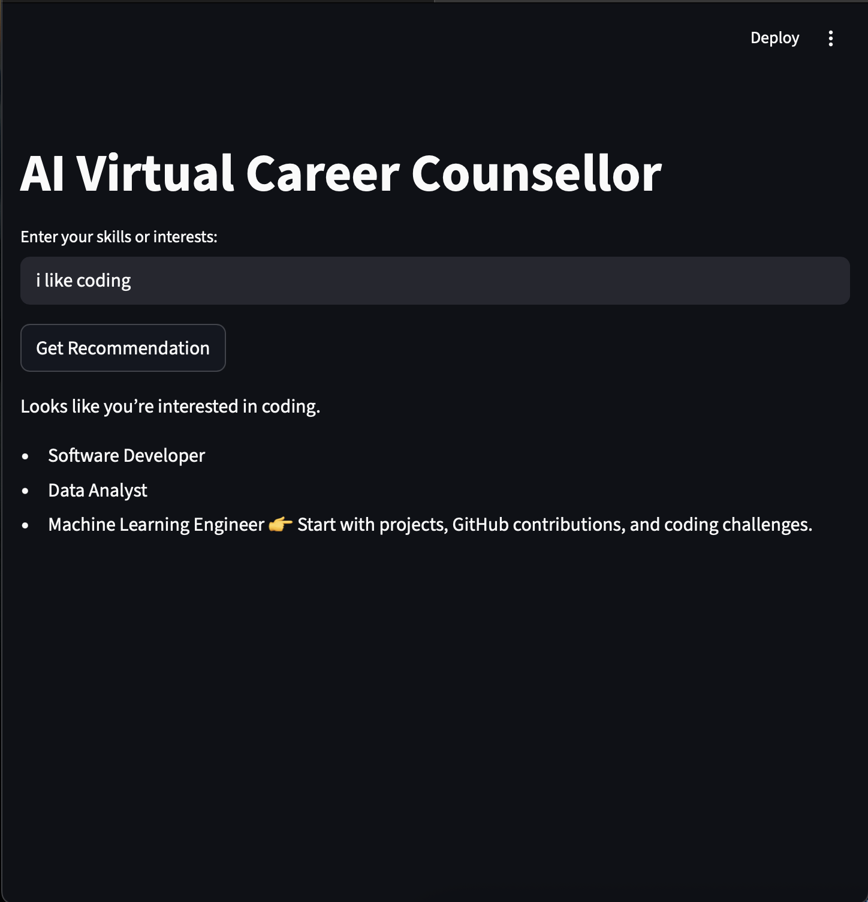
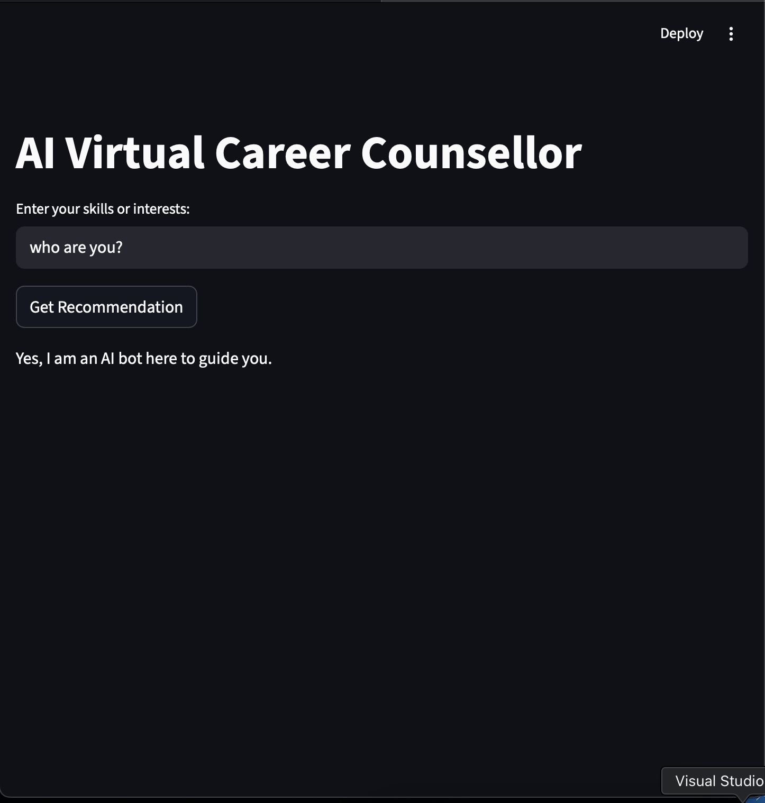

# AI-Virtual-Career-Counsellor

An AI-powered career counselling assistant that recommends career paths based on user interests using a **Streamlit interface** and a **Rasa chatbot**.

## What's Included

- `app.py` – Streamlit frontend  
- `rasa/` – Chatbot backend  
- `screenshots/` – App interface images  

## Tools & Technologies

- Python  
- Streamlit  
- Rasa  
- NLTK  

## Key Features

- Recommends career paths (Tech, Arts, Commerce)  
- Interactive chatbot interface  
- Processes user input using NLP  
- Simple and user-friendly UI  

## Screenshots

  
  

## How to Run

```bash
pip install streamlit rasa nltk
streamlit run app.py
